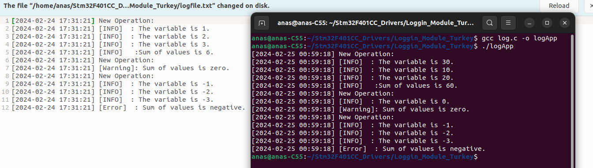
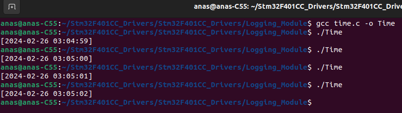

# Think How to Log any program status

I made an application responsible for summing group of variables and log the passed variable and the result : 

- I logs the Variables values which the user passed.
  - User Can pass any number of parameters.
- Make Addition operation on the variables.
- IF the result bigger than Zero, **INFO** Log Message is triggered.
- IF the result Equal Zero, **Warning Message** is triggered.
- IF the result Smaller than Zero, **Error** Message is triggered.
- The user can Select Logging Channel (Console /Terminal or Text file or both).
- The user can Select the Severity :
  - **INFO** 	: Show the All logging messages includes operation information, warnings and errors.
  - **WARNING**: Show ONLY the operation warnings
  - **ERROR**      : Show ONLY the operation errors 



### 1. You should Select the logging channel (Console / Terminal or File)

You can create function to set the Log channel, for example

```c
int Log_SetChannel(int channel) {
	return channel;
}
```

### 2. You should Select the log Severity (The importance of logs)

You can create function to select *log-Severity*

```c
int Log_SetSeverity(int severity) {
	return severity;
}
```

### 3. How to use the Date and the time for logging 

If you use  *C  Programming* , you can include **time.h** library 

```c
#include<stdio.h>
#include<time.h>

int main()
{
     time_t rawtime;
    struct tm *timeinfo;
    char timestamp[20];
    time(&rawtime);
    timeinfo = localtime(&rawtime);
    strftime(timestamp, sizeof(timestamp), "%Y-%m-%d %H:%M:%S", timeinfo);

    printf("[%s] ", timestamp);
}

```

>- `time_t rawtime;`: Declares a variable `rawtime` of type `time_t`, which represents calendar time.
>
>  - `struct tm *timeinfo;`: Declares a pointer `timeinfo` to a structure of type `tm`, which holds the components of time (e.g., year, month, day, hour, minute, second).
>
>  - `char timestamp[20];`: Declares a character array `timestamp` to store the formatted time string.
>
>  - `time(&rawtime);`: Retrieves the current time (in seconds since the Epoch) and stores it in the `rawtime` variable.
>
>  - `timeinfo = localtime(&rawtime);`: Converts the raw time value to a local time representation and stores it in the `timeinfo` structure.
>
>  - `strftime(timestamp, sizeof(timestamp), "%Y-%m-%d %H:%M:%S", timeinfo);`:
>
>    -  Formats the time information stored in `timeinfo` according to the specified format ("%Y-%m-%d %H:%M:%S") and stores the result in the `timestamp` array.
>
>    - The Format is : (Years , Months, Days , Hours , Minutes ,Seconds ).
>
>  - `printf("[%s] ", timestamp);`: Prints the formatted timestamp to the console, enclosed in square brackets.
>
>**Output**:
>
>


### 4. How to print the Date and Time on Text File 

```c
#include "stdio.h"
#include "time.h"
void printTime(FILE *logFile) {
    time_t rawtime;
    struct tm *timeinfo;
    char timestamp[20];
    time(&rawtime);
    timeinfo = localtime(&rawtime);
    strftime(timestamp, sizeof(timestamp), "%Y-%m-%d %H:%M:%S", timeinfo);
    // Print time to file
    if (logFile != NULL) {
        fprintf(logFile, "[%s]\n", timestamp);
    }
}


int main() {
    // Open text file in append mode
    FILE *logFile = fopen("time_log.txt", "a");
    if (logFile == NULL) {
        perror("Error opening file");
        return 1;
    }
    
    // Print time to console and file
    printTime(logFile);   // Print to file
    
    // Close file
    fclose(logFile);

    return 0;
}
```

>- This function takes a `FILE` pointer as an argument, which specifies the file to which the current time will be printed.
>
>- It uses the `time` function to get the current time in seconds since the Epoch.
>
>- Then, it converts the raw time to local time representation using `localtime`.
>
>- Next, it formats the time as a string in the format `"%Y-%m-%d %H:%M:%S"` (YYYY-MM-DD HH:MM:SS) using `strftime`.
>
>- `strftime` is a function in the C programming language that stands for "string format time". It is used to convert a `struct tm` object representing a point in time to a formatted string representation according to a specified format.
>
>  Here's how `strftime` works: 
>
>  - **`timestamp`**: This is the destination buffer where the formatted time string will be stored. It is a character array (`char timestamp[20]` in my example) that holds the formatted time string.
>
>  - **`sizeof(timestamp)`**: This is the size of the destination buffer `timestamp`. It specifies the maximum number of characters that `strftime` can write into the `timestamp` buffer, including the null-terminating character. In your example, `sizeof(timestamp)` evaluates to the size of the `timestamp` array, which is typically `20` characters (assuming `timestamp` is declared as `char timestamp[20]`).
>
>  - **`"%Y-%m-%d %H:%M:%S"`**: This is the format string that specifies the desired format for the time representation. It consists of format specifiers that begin with a percentage sign (`%`) followed by a character. Each format specifier represents a specific component of the time.
>
>    - `%Y`: Represents the year (e.g., `2024`).
>    - `%m`: Represents the month (e.g., `02` for February).
>    - `%d`: Represents the day of the month (e.g., `23`).
>    - `%H`: Represents the hour in 24-hour format (e.g., `14` for 2 PM).
>    - `%M`: Represents the minute (e.g., `45`).
>    - `%S`: Represents the second (e.g., `30`).
>
>  - **`timeinfo`**: This is a pointer to a `struct tm` object containing the time information to be formatted. The `struct tm` type represents a time structure with various components such as year, month, day, hour, minute, and second.
>
>    So, when you call `strftime(timestamp, sizeof(timestamp), "%Y-%m-%d %H:%M:%S", timeinfo);`, `strftime` formats the time information stored in the `timeinfo` structure according to the specified format string `"%Y-%m-%d %H:%M:%S"`, and writes the formatted time string into the `timestamp` buffer. The resulting formatted time string will look something like `"2024-02-23 14:45:30"` based on the current time stored in `timeinfo`.
>
>    
>
>- Finally, it prints the formatted timestamp to the specified file using `fprintf`.
>
>**`main` Function**:
>
>- In the function:
>  - It declares a file pointer `logFile` to handle the log file.
>  - It opens the `time_log.txt` file in append mode using `fopen`. If the file cannot be opened, it prints an error message using `perror` and returns 1 to indicate an error.
>  - It calls the `printTime` function to print the current time to the log file.
>  - Finally, it closes the log file using `fclose` to release system resources (txt file).


### 5. Variadic Function 

I made a variadic function which summing all the input parameters 

```c
#include <stdio.h>
#include <stdarg.h>
int AddValues(int count, ...) {
    int sum = 0;
    va_list args;
    va_start(args, count);
    
    // Sum up the values
    for (int i = 0; i < count; i++) {
        int val = va_arg(args, int);
        sum += val;
    }
    va_end(args);
       
    return sum;
}
int main() {

    printf("Sum of 10, 20, 30: %d\n", AddValues(3, 10, 20, 30));
    
    return 0
}

```

 >
 >
 >1. It defines a function named `AddValues` that takes an :
 >   - Integer `count` as its first argument. This argument specifies the number of values that will be provided as variable arguments
 >   - ellipsis (`...`) to refer to variable number of arguments. 
 >2. **`va_list args;`**: This declares a variable of type `va_list`, which is used to access the variable arguments passed to the function.
 >3. **`va_start(args, count);`**: This macro initializes the `va_list` object `args` to point to the first variable argument in the argument list. The `count` parameter specifies the last named parameter before the variable arguments.
 >4. **`for (int i = 0; i < count; i++) {`**: This `for` loop iterates `count` times, where `count` is the number of variable arguments specified when calling the function.
 >5. **`int val = va_arg(args, int);`**: Inside the loop, this line retrieves the next variable argument from the `va_list` object `args` and assigns it to the integer variable `val`. Each call to `va_arg` advances the `args` pointer to the next argument in the list.
 >6. **`sum += val;`**: This line adds the value of `val` to the `sum`, accumulating the total sum of all provided values.
 >7. **`va_end(args);`**: This macro cleans up the `va_list` object `args` after all variable arguments have been processed. It must be called before the function returns to release any resources associated with the `va_list`.


### 6. Log Write Function 


